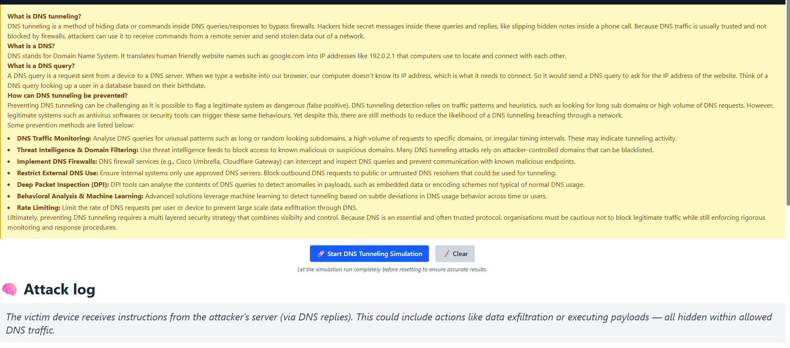
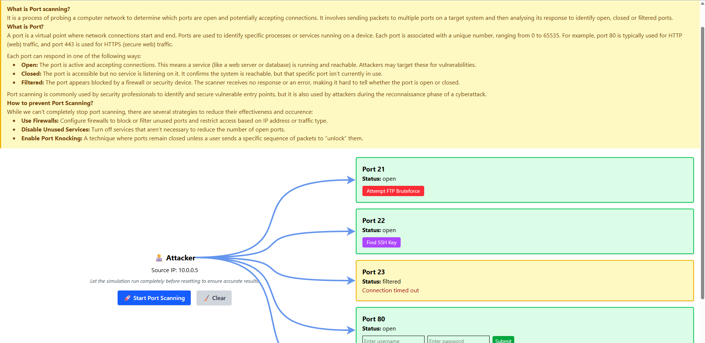
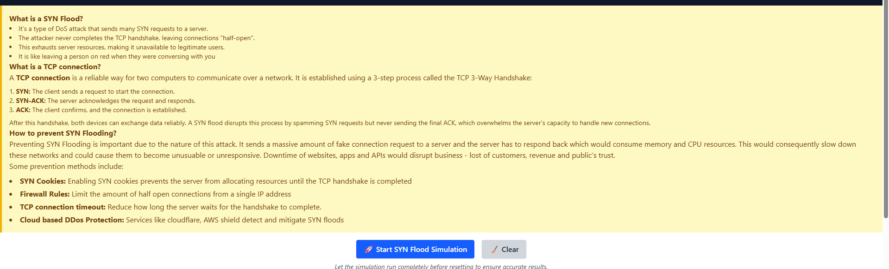

# Network Attack Visualiser

## What is it?
The Network Attack Visauliser is simple web based tool designed to simultae and demonstrate various types of network attacks
such as SYN floods, Port scanning and DNS tunneling. It helps users regardless of technical background understand how attacks work
at the packet level and how network devices respond. This visualisation tool is useful for educational purposes, especially in learning 
cybersecurity concepts, severity and consequences of cyber attacks and mitigation techniques.

## Context
Nowadays, cyberattacks are becoming more sophiscated, from obscuring phising links to using AI to anaylse massive bulks of data for trends/patterns.
As the volume and complexity of attacks increase, so does the need for tools that help individual and organisation regardless of background to understand 
and defend against them. This project was developed as part of my COMP6841 assignment. My project aims to emulate a multitude of network attacks so that 
users can connect theoretical concepts with real world network activity. My simulation includes network attacks such as DNS tunneling, port scanning 
and SYN floods which are amongst the most common attacks out there. Through this educational simulation, users can build a stronger conceptual 
and practical understanding of network threats.

## Installation

### Common installation errors
Your npm version is below v18. We can check this by doing node -v.
You can install the new version using either "sudo npm install -g n" and then "sudo n latest" or install using 
"nvm install versionplaceholder" and "nvm use versionplaceholder"
### Method 1
This was done on WSL Unbuntu, so it is best to start it on the same subsystem

To run this program, git clone the repository (https version)

Then give permission to the start.sh file - chmod 755 start.sh. Then run the file and on your terminal, there should be a localhost.
Don't use the popup localhost but one on terminal since the popup gives to an invalid url. The port should be user forwarded and not auto forwarded

### Method 2
If the shell script doesn't work, you can manually run both the frontend and the backend. Ensure that you have pip3 and npm installed. 
To do this, just clone the repository, then open two terminals, one in the frontend folder and other in backend folder.
Ensure that you install everything once you are in these directories (Frontend you can just install it using npm install, backend you need to manually
install Flask - reference start.sh)
Then run frontend using npm run dev, and run backend using python3 run.py.

## Misc/Blog

### Implementation

My project is built using a full-stack web development approach utilising the following tech stack:
  Frontend  - React, using javascript
  Backend - Flask, using python
  Styling: Tailwind

I used React for easy and dynamic front end interactions and real time visual feedback. Flask was used for handling data being sent from the backend. I’ve had some familiarity utilising these two tech stacks, so this was my choice. I used Tailwind for my styling since it was flexible for all viewports and also reduces the amount of files I’d have to create.
My research and notes can be seen inside notes.txt
The main features I’ve aimed to implement was the visualisation of the network attacks, and how packets are utilised within these network attacks. The showcase of the packets were significantly simplified so that all users can easily understand. Below are some of my page prototypes of the attack and my thought process behind it.

My thought process behind these design process is that at the top, I would have some background information about the network attack. This would go through the terminology, consequences 
and severity, and prevention or mitigation techniques. These information were stored inside a yellow section for improved visibility with a reddish font - this passes the WCAG requirement.
Below the information I would have a simple visualisation whether its a flow based diagram or a graph, these would assist in demonstrating how the attack works.
And finally at the bottom or inside the visualisation would contain a simple interaction activity which aims to reinforce the theory concept that was above it.

### Reflection
Throughout this project, I developed a deeper understanding of how common network attacks like DNS tunneling, SYN floods, and port scanning operate at both a conceptual and packet level.
Initially, I had some knowledge about how network operates (from COMP3331), however, there wasn't any delving into network attacks. From this project, I've not only better my understanding
of these network attacks, but I also further refined my frontend skills. 

## Bibliography
https://developer.mozilla.org/en-US/docs/Glossary/TCP_handshake
https://www.akamai.com/glossary/what-is-dns-tunneling
https://www.paloaltonetworks.com.au/cyberpedia/what-is-dns-tunneling
https://www.brightsec.com/blog/dns-tunneling/
https://www.fortinet.com/resources/cyberglossary/what-is-port-scan
https://www.paloaltonetworks.com.au/cyberpedia/what-is-a-port-scan
https://www.w3schools.com/cybersecurity/cybersecurity_mapping_port_scanning.php
https://www.cloudflare.com/learning/ddos/syn-flood-ddos-attack/
https://www.akamai.com/glossary/what-are-syn-flood-ddos-attacks
https://www.f5.com/glossary/syn-flood-attack